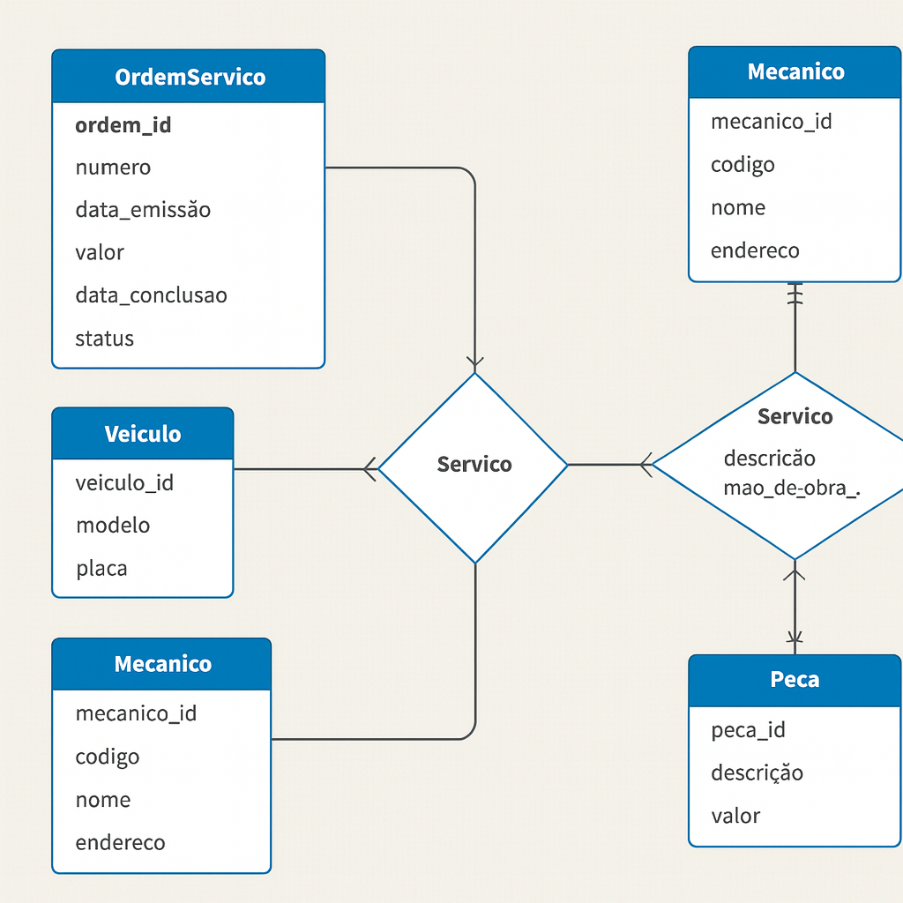

# esquemaconceitual
## Descrição

Este projeto apresenta o modelo conceitual de um sistema de controle e gerenciamento de ordens de serviço em uma oficina mecânica. O objetivo é representar as entidades, atributos e relacionamentos envolvidos no processo de atendimento ao cliente, execução de serviços e controle de peças e mão de obra.

## Objetivo

Criar um esquema conceitual do zero para representar o funcionamento de uma oficina mecânica, considerando:

- Cadastro de clientes e veículos
- Designação de veículos a equipes de mecânicos
- Emissão e controle de ordens de serviço (OS)
- Cálculo de valores com base em serviços e peças
- Execução e acompanhamento dos serviços

## 🧠 Entidades e Relacionamentos

### Principais Entidades:

- **Cliente**: nome, endereço
- **Veículo**: modelo, placa
- **Mecânico**: código, nome, endereço, especialidade
- **Equipe**: grupo de mecânicos
- **Ordem de Serviço (OS)**: número, data de emissão, valor, status, data de conclusão
- **Serviço**: descrição, valor estimado, referência de mão de obra
- **Peça**: descrição, valor

### Relacionamentos:

- Um **cliente** pode ter vários **veículos**
- Um **veículo** pertence a um único **cliente**
- Um **veículo** é atendido por uma **equipe**
- Uma **equipe** é composta por vários **mecânicos**
- Uma **OS** está associada a um **veículo**, um **cliente** e uma **equipe**
- Uma **OS** pode conter vários **serviços** e várias **peças**
- Um **serviço** pode aparecer em várias **OS**
- Uma **peça** pode ser usada em várias **OS**

## Modelo

